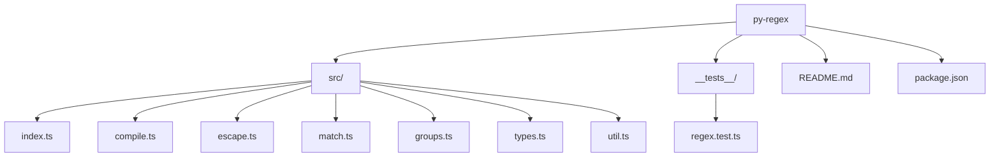

# PLAN: Migration and Refactor for py-regex

## 1. Project Goal

Extract all Python/PCRE regex compatibility logic from `xtrax` into this new `py-regex` package, with a Pythonic API and adapted tests. The result should be instantly familiar to users of Python's `regex` module and maintain 100% fidelity to Python's behavior.

Using the @syntropic/libpcre-ts library, we will create a new package that provides a Pythonic interface to regex functionality, closely mirroring Python's `regex` module.

---

## 2. Migration Scope

- Move all files in `xtrax/pcre-utils/`
- Move PCRE/Python regex helpers/types from `xtrax/index.ts`
- Move PCRE-related tests from `xtrax/__tests__/`

---

## 3. New Package Structure



---

## 4. Migration Steps

### a. Move and Refactor Source Files

- Move and split code as per the new structure.
- Refactor exports to match Python’s `re` API:
  - `escapeRegex` → `regex.escape`
  - `convertNamedGroups` → internal, used by `regex.compile`
  - `compileRegex` → `regex.compile`
  - `compileRegexPartial` → `regex.compile` with partial flag
  - Adapt types to match Python’s `re.Pattern`, `re.Match`, etc.

### b. Adapt and Move Tests

- Move all regex/PCRE-related tests to `py-regex/__tests__/regex.test.ts`
- Adapt tests to use the new API:
  - `regex.compile(pattern, flags)`
  - `pattern.fullmatch(string)`
  - `pattern.match(string)`
  - `pattern.search(string)`
  - `regex.escape(string)`
  - Test named groups, escaping, edition normalization, etc.

### c. Update Documentation

- Write `py-regex/README.md` with usage examples mirroring Python’s `re` docs.
- Document any differences from Python’s `regex`.

### d. Update xtrax

- Remove all PCRE/regex-specific code from `xtrax/pcre-utils/` and `xtrax/index.ts`
- Remove PCRE/regex-specific tests from `xtrax/__tests__/`
- Update `xtrax/README.md` to reference the new package.

---

## 5. API Example

```typescript
import { regex } from 'py-regex';

const pattern = regex.compile('(?P<volume>\\d+) (?P<page>\\d+)', 'i');
const m = pattern.fullmatch('123 456');
console.log(m?.group('volume')); // '123'
console.log(m?.groups); // { volume: '123', page: '456' }

const escaped = regex.escape('Ala. Admin. Code');
console.log(escaped); // 'Ala\\. Admin\\. Code'
```

---

## 6. Migration Checklist

- [ ] Move and refactor all PCRE/regex code to `py-regex/src/`
- [ ] Adapt and move all regex-related tests to `py-regex/__tests__/`
- [ ] Remove PCRE/regex code and tests from `xtrax`
- [ ] Update `xtrax/README.md` and docs
- [ ] Write `py-regex/README.md` with Pythonic usage
- [ ] Test for 100% Python fidelity